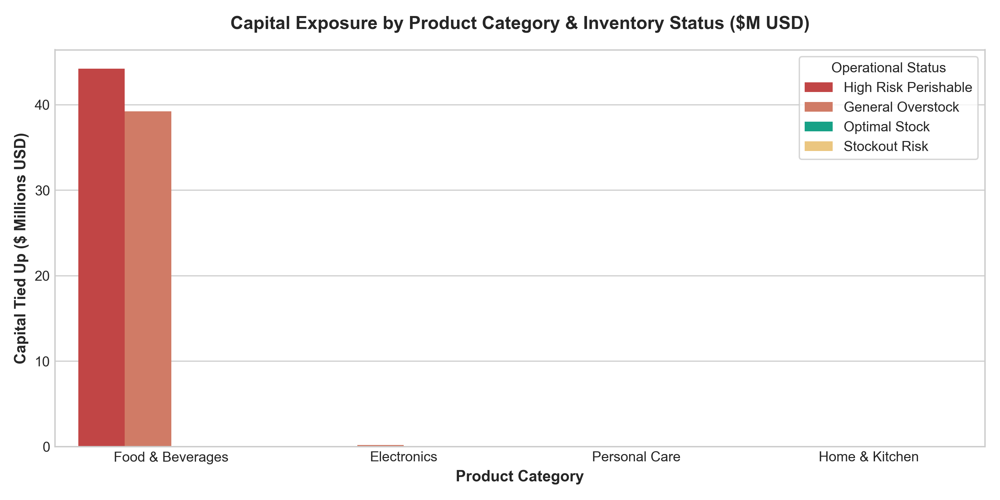

# 📦 Supply Chain & Inventory Health Analysis: Capital Recovery Strategy

## Executive Summary
This project addresses a critical operational challenge: an organization holding **$83.7M USD in total inventory**, where global averages masked severe operational inefficiencies. Through a custom data analytics pipeline, we identified that **99.7% of the capital was tied up in overstock**, with **$44.2M USD in high-risk perishable items** (Food & Beverages) exceeding 45 days of supply (DSI).

A 30-60-90 day remediation strategy was designed to release **+$40M USD in cash flow** and elevate inventory turnover from **3.68 to 6.0 turns/year**.

---

## 📊 Key Operational Metrics & Findings

| Metric | Baseline (Day 0) | Target (Day 90) | Impact / Status |
| :--- | :--- | :--- | :--- |
| **Total Capital Tied Up** | $83.7M USD | ~$35.0M USD | **-$48.7M USD** |
| **Perishable Risk Stock (>45d)** | $44.2M USD | $0.0M USD | **FEFO Clearance & Bundling** |
| **Inventory Turnover** | 3.68 turns/yr | 6.00 turns/yr | **+63% Efficiency** |
| **Average Days of Supply (DSI)**| 99.1 days | 60.0 days | **-39.1 Days Reduction** |
| **Critical Stockouts Risk** | SKU-1136 (2.7d) | Min. 15 days | **Emergency PO Released** |

> **Key Takeaway:** The "Average Trap" was hiding critical skewness. While overall inventory appeared healthy at face value, individual SKU analysis revealed massive capital stagnation in slow-moving items alongside immediate stockout risks in core revenue drivers.
> ### 📊 Inventory Capital Exposure Analysis


*Figure 1: Breakdown of $83.7M USD working capital tied up by category and operational risk status.*

---

## 🛠️ Technical Architecture & Pipeline

The analysis was performed by combining SQL for data extraction/aggregation and Python (Pandas/Seaborn) for SKU segmentation and financial exposure mapping.

1. **Data Ingestion & Cleaning:** Handling missing dates, normalising SKU cost structures, and calculating `Daily Sales Rate (DSR)`.
2. **Metrics Engine:**
   $$\text{DSI} = \frac{\text{Current Stock On Hand}}{\text{Average Daily Demand}}$$
   $$\text{Turnover Ratio} = \frac{\text{COGS (Annual)}}{\text{Average Inventory Value}}$$
3. **Segmentation Matrix:** Categorizing SKUs into `Stockout Risk` (<7d), `Optimal` (7-30d), and `Overstock / Perishable Risk` (>45d).

---

## 🚀 30-60-90 Day Actionable Roadmap

```text
 PHASE 1: Days 1-30          PHASE 2: Days 31-60          PHASE 3: Days 61-90
 Triage & Containment        Monetization & Clearance     ERP Governance & S&OP
 📊 PO Freeze (Overstock)    📦 Bundling (Zombie+Star)    ⚙️ Max/Min ERP Locks
 🚨 Emergency PO (SKU-1136)  🏷️ B2B Liquidation / Outlets 📈 S&OP Forecast Rules
 🚚 FEFO Slotting Priority   🏛️ Tax Deductible Loss Proc. 🎯 Target 6.0 Turns/Yr
